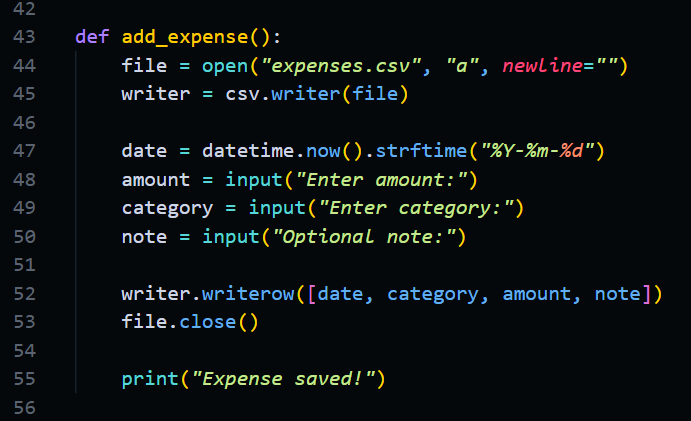
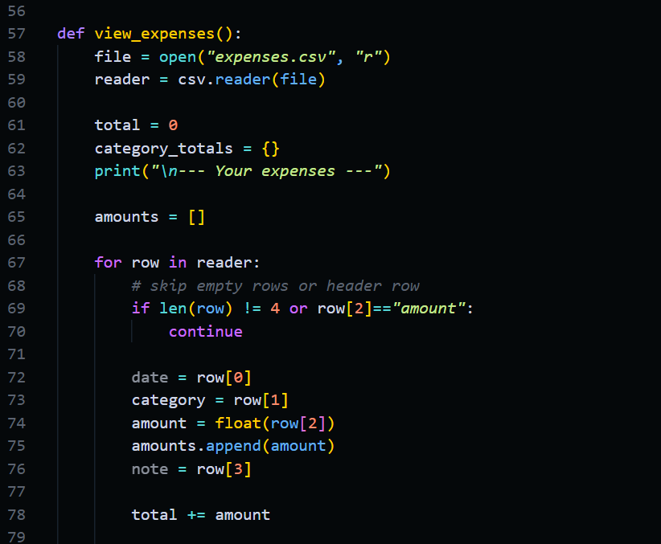
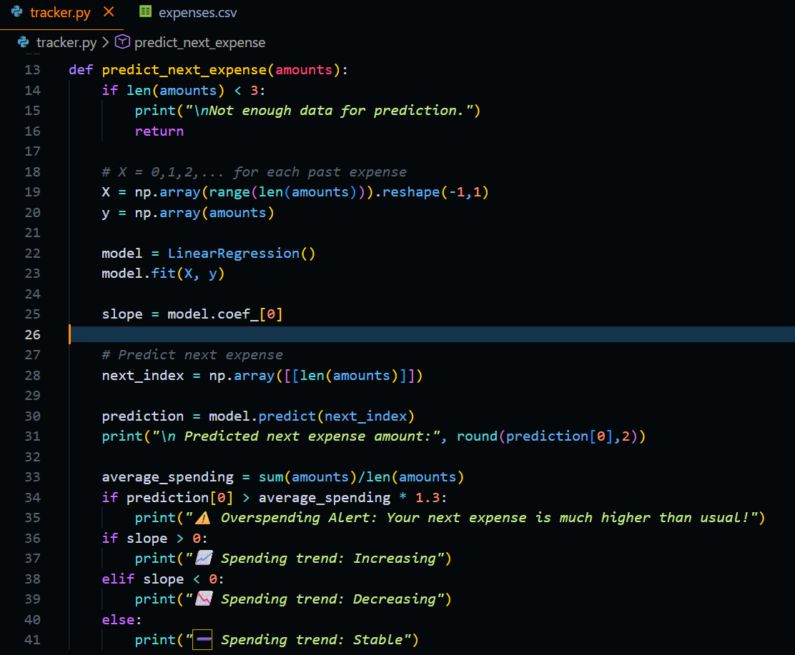
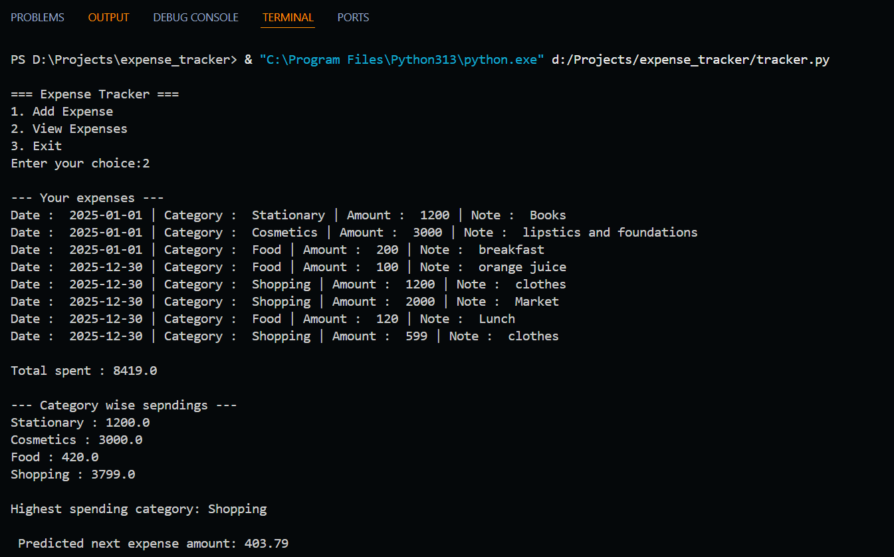

# 💰 Expense Tracker with ML-Based Prediction

A beginner-friendly Python project that tracks daily expenses, analyzes spending patterns, and uses **Linear Regression (Machine Learning)** to predict future expenses and detect potential overspending.

This project is designed to demonstrate **core Python skills, data handling, and basic ML integration** in a clean, explainable way — perfect for students and early-career developers.

---

## 🚀 Features

- Add expenses with date, category, amount, and notes
- Store data persistently using CSV files
- View all expenses in a readable format
- Calculate total spending
- Category-wise spending analysis
- Identify highest spending category
- 🤖 Predict next expense using Linear Regression
- 📈 Detect spending trend (increasing / decreasing / stable)
- ⚠️ Overspending alert based on predicted behavior

---

## 🧠 Machine Learning Used

- **Model:** Linear Regression (scikit-learn)
- **Input:** Sequence of past expenses
- **Output:** Predicted next expense amount
- **Interpretation:**
  - Slope of the regression line determines spending trend
  - Prediction compared with average spending to trigger alerts

This ML approach is simple, interpretable, and ideal for beginners.

---

## 🛠️ Tech Stack

- Python 3
- CSV (data storage)
- NumPy
- scikit-learn

---

## 📂 Project Structure

```
expense_tracker/
│
├── tracker.py        # Main application
├── expenses.csv      # Stored expense data
└── README.md         # Project documentation
```

---

## ▶️ How to Run

1. Clone the repository:
```bash
git clone https://github.com/your-username/expense-tracker-ml.git
```

2. Navigate to the project folder:
```bash
cd expense-tracker-ml
```

3. Install dependencies:
```bash
pip install numpy scikit-learn
```

4. Run the program:
```bash
python tracker.py
```

---

## 📸 Sample Output

### ➕ Add Expense


### 📋 View Expenses


### 📊 Category-wise Spending


### 🤖 ML Prediction & Trend Analysis


### 🧾 Complete Sample Output


```
--- Your expenses ---
Date: 2025-12-30 | Category: food | Amount: 100 | Note: juice

Total spent: 5700
Highest spending category: shopping

🤖 Predicted next expense amount: 1480.25
📈 Spending trend: Increasing
⚠️ Overspending Alert: Your next expense is much higher than usual!
```

---

## 🎯 Learning Outcomes

- File handling with CSV
- Data aggregation and analysis
- Python functions and program structure
- Introductory Machine Learning concepts
- Model interpretation (not just prediction)
- Debugging and iterative development

---

## 🌱 Future Improvements

- Monthly expense aggregation
- Category-wise ML prediction
- Data visualization using matplotlib
- GUI or web interface

---

## 👩‍💻 Author

**Siya**  
Engineering Student | Python Enthusiast

---

## ⭐ Why This Project Matters

This project bridges the gap between **basic Python scripting** and **applied Machine Learning**, showing how ML can be used meaningfully even with small datasets.

If you find this useful, consider starring ⭐ the repository!

